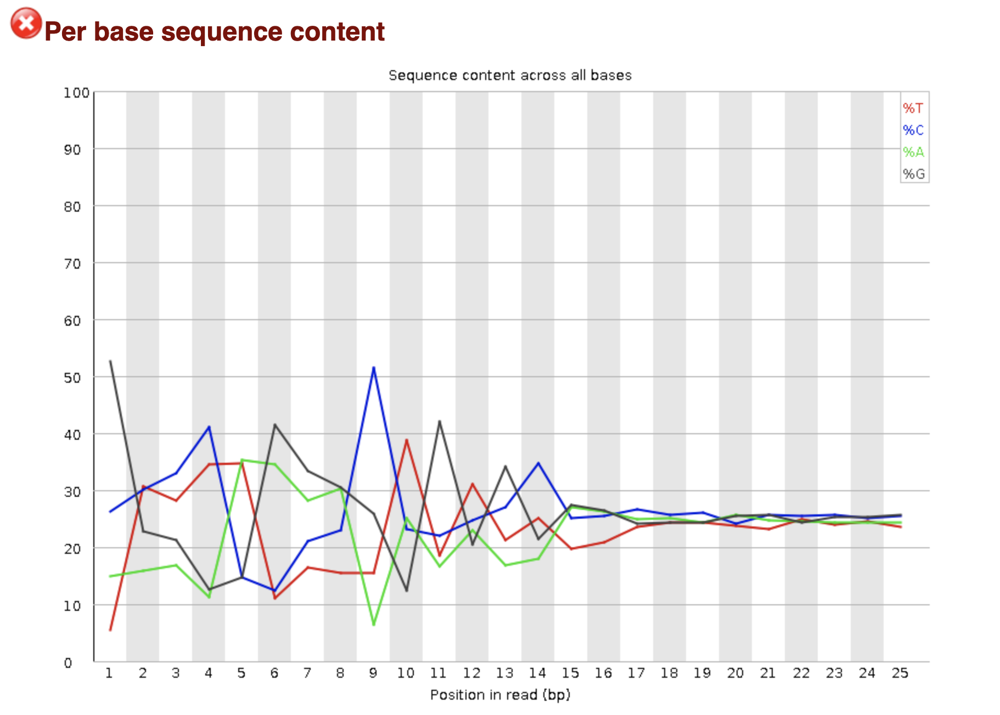

# CUT&Tag
## **UNDER CONSTRUCTION**

Step-by-step analysis pipeline for CUT&Tag data
#### [Cebola Lab](https://www.imperial.ac.uk/metabolism-digestion-reproduction/research/systems-medicine/genetics--genomics/regulatory-genomics-and-metabolic-disease/)

The CUT&Tag protocol is available as the [CUT&Tag@home](https://www.protocols.io/view/cut-amp-tag-home-bd26i8he?step=50) and [Bench top CUT&Tag V.3](https://www.protocols.io/view/bench-top-cut-amp-tag-bcuhiwt6). The following pipeline is adapted from the authors processing and analysis tutorial by Zheng Y et al (2020). Protocol.io. available [here](https://www.protocols.io/view/cut-amp-tag-data-processing-and-analysis-tutorial-bjk2kkye). 

The following pipeline describes each analysis step:

- [Pre-alignment quality control (QC)](#pre-alignment-qc) 
- [Alignment](#alignment)
- [Post-alignment QC](#post-alignment-qc)
- [Convert, calibrate and visualise](#convert,-calibrate-and-visualise) 
- [Peak Calling](#peak-calling)
- [Motif Finding](#motif-finding)
- Cut Matrix Generation
- Motif Footprinting Steps

All required programs required have been installed and are available in the CebolaLab [CUTandTAG anaconda environment](https://github.com/CebolaLab/CUTandTAG/tree/master/anaconda-env). If you are using anaconda, you can copy this into your own anaconda environments (on the Imperial College HPC, for example, this is located at `/rdsgpfs/general/user/"$(whoami)"/home/anaconda3/envs/`) and then `source activate CUTandTAG`. The pipeline can also be run without installing anaconda by directing the necessary scripts to the `bin` of the downloaded CUTandTAG environment (download the CUTandTAG directory and save it e.g. to your home directory).

For the following analysis, you can save your sample file name as `base` and the example scripts will access this variable using `<sample>`. 

## Pre-alignment QC

A common tool used to assess the quality of raw sequence reads is [fastQC](https://www.bioinformatics.babraham.ac.uk/projects/fastqc/). The report, which comes in html format, can be used as guidance to the general quality of the data. Some failed or 'warning' results are usually not too concerning and can be improved using various processing tools. One metric which may be observed to fail is the Per base sequence content. As [described by the CUT&Tag authors](https://www.protocols.io/view/cut-amp-tag-data-processing-and-analysis-tutorial-bjk2kkye?step=6), this can result from a sequence preference of the Tn5 transposase or the 10bp periodicity in the length distribution and is not a cause for concern:



If using the [Benchop CUT&Tag protocol](https://www.protocols.io/view/bench-top-cut-amp-tag-bcuhiwt6/abstract), sequence length should be 25bp. With this length, there is not expected to be any contamination of adapters (which results when the sequence lenght is longer than the DNA fragment and so the sequencing extends into the adapter sequence). Adapter trimming, which is a common step in NGS pipelines, is not recommended unless the user has opted to sequence longer reads (>25bp).

### Combine samples sequenced across multiple lanes

If any samples have been sequenced across multiple lanes, these should now be concatanated. For example:

```
cat <sample>_lane*_R1.fastq.gz > <sample>_R1.fastq.gz
```

```
cat <sample>_lane*_R2.fastq.gz > <sample>_R2.fastq.gz
```

## Alignment

Two alignments will be run to align the human DNA and carry-over E.coli DNA later used to standardise the samples. The alignment parameters are run as recommended by the CUT&Tag authors (see their [pipeline](https://www.protocols.io/view/cut-amp-tag-home-bd26i8he?step=50)). The authors recommend to skip adapter trimming and to run the alignments using bowtie2 with the below parameters, which should result in accurate read alignment. This pipeline aligns to the hg19 reference genome. If the user is aligning to the more recent GRCh38 release, it is recommended to remove alternative contigs, otherwise reads may not map uniquely and will consequently be assigned a low quality score. Suggested guidelines for preparing the GRCh38 genome are discussed in [this tutorial](https://www.biostars.org/p/342482/). Two alignments are carried out:

1. Align reads to the reference **human** genome (hg19) (download [here](http://hgdownload.cse.ucsc.edu/goldenpath/hg19/bigZips/))
2. Align reads to the reference **E.coli** genome (strain K12, substrain MG1655) (downloaded [here](https://www.ncbi.nlm.nih.gov/nuccore/U00096.3?report=fasta)).

Both reference genomes should be [indexed](http://bowtie-bio.sourceforge.net/bowtie2/manual.shtml#indexing-a-reference-genome) using bowtie2. For those with access to the Imperial College HPC and the Cebola Lab project space, the reference genomes and index files are available at this path:

`/rds/general/user/"$(whoami)"/projects/cebolalab_liver_regulomes/live/reference-genomes/` 

The alignments are carried out using bowtie2 with the below arguments. An example script is available [here](https://github.com/CebolaLab/CUTandTAG/blob/master/alignment.sh).

#### Parameters to align human reads:

For mapping of inserts greater than 700bp, increase the -X parameter. 

```
--end-to-end --very-sensitive --no-mixed --no-discordant --phred33 -I 10 -X 700
```

If the user is sequencing >25bp, adapters will need to be trimmed using a tool such as fastp, cutadapt or trimmomatic, and the alignment parameters should be adjusted to read:

```
--local --very-sensitive --no-mixed --no-discordant --phred33 -I 10 -X 700
```

#### Parameters to align E.coli reads:

Fastq files should also be aligned to the E.coli U00096.3 genome (strain K12, substrain MG1655) if downstream normalisation between samples is to be carried out [recommended].

```
--end-to-end --very-sensitive --no-overlap --no-dovetail --no-mixed --no-discordant  --phred33 -I 10 -X 700
```

Summaries of the alignment are reported in a `.bowtie2` file, for example:


Where 2702260 is the total number of DNA fragments. For CUT&Tag experiments, the total number of mapped fragments (i.e. 96.26% of 2702260 in this example) may be as low as 1 million for experiments probing histone marks. When investigating less abundant transcription factors, for example, this may need to be as high as 10 million mapped fragments. 

## Post-alignment QC

### Assess quality

A `bash/R` script adapted from the [CUT&Tag processing and analysis tutorial](https://www.protocols.io/view/cut-amp-tag-data-processing-and-analysis-tutorial-bjk2kkye?step=12&comment_id=90048) is included in this repository to generate a  **quality report**. The information presented includes the % of mapped reads, the % of mitochondrial reads, the % of E.coli reads and the % of duplicate reads. In general, the % of duplicates is expected to be low in a CUT&Tag experiment.

Firstly, the aligned `bam` file should be sorted and indexed, here using [picard](https://broadinstitute.github.io/picard/) tools:

```
picard SortSam I=<input>.bam O=<input>-sorted.bam SO=coordinate CREATE_INDEX=TRUE
```

#### The % of mitochondrial reads 

To assess the total % of mitochondrial reads, run `samtools idxstats` on your indexed and sorted bam file:

```
samtools idxstats <sample>-sorted.bam > <sample>.idxstats
```

The following command will show you how many reads align to the mitochondrial chromosome (chrM):

```
grep "chrM" <sample>.idxstats
``` 

Where 16571 is the length of the chromosome and 2464 is the total number of aligned reads.


#### The % of E.coli reads 

The `<sample>.Ecoli.bowtie2` file shows the % of E.coli reads in the last line, here 0.02%:


#### The duplication rate

To mark	 duplicate reads:

```
picard MarkDuplicates QUIET=true INPUT=<sample>.rmChrM.bam OUTPUT=<sample>.marked.bam METRICS_FILE=<sample>.sorted.metrics REMOVE_DUPLICATES=false CREATE_INDEX=true VALIDATION_STRINGENCY=LENIENT TMP_DIR=.
```

The % of duplicates can be viewed using:

```
head -n 8 <sample>-markDup.metrics | cut -f 7,9 | grep -v ^# | tail -n 2
```

#### QC report

A hmtl QC report can be output using [qualimap](http://qualimap.bioinfo.cipf.es/).

```
qualimap bamqc -bam <sample>.filtered.bam -gd hg19 -outdir . -outfile <sample>.qualimap.report -outformat html
```

The qualimap report contains a plot of the DNA insert size, which may be expected to show fragments consistent with multiples of nucleosomal lengths (~180 bp), since CUT&Tag typically inserts adapted on either side of a nucleosome. Shorted particles may result from tagmentation within a chromatin particle, in linker DNA regions, or from a section of DNA bound by a transcription factor, for example. The qualimap plot appears as:


### Carry out QC filtering

The aligned data will be filtered to: 

- Remove mitochondrial reads
- Remove duplicate reads
- Remove reads with a mapping quality <30 (includes non-uniquely mapped reads)

#### Remove mitochondrial reads

```
samtools view -h <sample>-sorted.bam | grep -v chrM | samtools sort -O bam -o <sample>.rmChrM.bam -T .
```

#### Remove duplicate reads [optional]

It may be recommended to remove duplicate reads if the % of duplicates is particularly high. To remove duplicate reads, run the following code:

```
samtools view -h -b -F 1024 <sample>.marked.bam > <sample>.rmDup.bam
```

If IgG controls are used, the duplicate level is expected to be high and duplicates should be removed.

The **estimated library size** and **unique fragment number** can be calculated excluding the observed duplicates.  

#### Assess mapping quality 

The output `sam/bam` files contain several measures of quality. First, the alignment quality score. Reads which are uniquely mapped are assigned a high alignment quality score and one genomic position. If reads can map to more than one location, Bowtie2 reports one position and assigns a low quality score. The proportion of uniquely mapped reads can be assessed. In general, >70% uniquely mapped reads is expected, while <50% may be a cause for concern [(Bailey et al. 2013)](https://www.ncbi.nlm.nih.gov/pmc/articles/PMC3828144/pdf/pcbi.1003326.pdf). Secondly, the 'flag' reports information such as whether the read is mapped as a pair or is a PCR duplicate. The individual flags are reported [here](https://hbctraining.github.io/Intro-to-rnaseq-hpc-O2/lessons/04_alignment_quality.html) and are combined in a `sam` file to one score, which can be deconstructed back to the original flags using [online interpretation tools](https://broadinstitute.github.io/picard/explain-flags.html). In this pipeline, the bowtie2 parameters `--no-mixed` and `--no-discordant` prevent the mapping of only one read in a pair, so these flags will not be present. All flags reported in a `sam` file can optionally be viewed using  `grep -v ^@ <sample>.sam | cut -f 2 | sort | uniq`.

#### Remove low quality reads

To view how many fragments align with a quality score >30, run:

```
samtools view -q 30 -c <sample>.marked.bam
```

This reports the number of DNA **reads** which align with a quality score >30 (to calculate the number of DNA **fragments**, divide the output by 2). A low % of uniquely mapped reads may potentially be observed when carrying out a CUT&Tag experiment for a protein which is expected to bind repetitive DNA. Alternatively, this may result from short reads, excessive PCR amplification or problems with the PCR [(Bailey et al. 2013)](https://www.ncbi.nlm.nih.gov/pmc/articles/PMC3828144/pdf/pcbi.1003326.pdf). Run the following code to remove reads with a score <30:

```
samtools view -q 30 -b <sample>.rmDup.bam > <sample>.filtered.bam
```

## Convert, calibrate and visualise

In this section, the aligned bam file will be converted to a bed format compatible with downstream analysis tools. If analysing multiple samples, calibration using the carry-over E.coli DNA should be carried out. The output `bedGraph` can then be visualised.  
### File conversion

The processed `bam` file should be converted to `BEDPE` format. This can be done using [bedtools](https://bedtools.readthedocs.io/en/latest/). The [BEDPE format](https://bedtools.readthedocs.io/en/latest/content/general-usage.html) is a specialised version of a [bed file](https://m.ensembl.org/info/website/upload/bed.html) 

The output bam files must be sorted by **queryname** in order to generate the BEDPE format in the next step. `<sample>` again refers to the your filename/sample ID:

```
picard SortSam I=<sample>.bam O=<sample>-sorted.bam SO=queryname CREATE_INDEX=TRUE

bedtools bamtobed -i <sample>.filtered.bam -bedpe > <sample>.bed
```

Importantly, the bedtools BEDPE format is slightly different from that required by the downstream tools. The file can be converted using this following code:

```
bedtools sort <sample>.bed > <sample>-sorted.bed

cut -f 1,2,6 <sample>.bed | sort -k1,1 -k2,2n -k3,3n > <sample>-converted.bed
```

### Calibration 

The samples will first be calibrated using the carry-over E.coli DNA (the effective 'spike-in'). In theory, the ratio of primary DNA to E.coli DNA is expected to be the same for each sample. As such, the calibration divides the mapped read count by the total number of reads aligned to the E.coli genome. The proportion of total DNA reads aligned to the E.coli genome is reported in the `<sample>.Ecoli.bowtie2` output file and can be obtained using: 

```
head -n1 <sample>.Ecoli.bowtie2 | cut -d ' ' -f1
```

The scaling factor, S, should be calculated as C / the number of E.coli reads, where C is an arbritary multiplier, typically 10,000:

```
seqdepth=$(head -n1 <sample>.Ecoli.bowtie2 | cut -d ' ' -f1)

scale_factor=$(echo "10000 / $seqdepth" | bc -l)

bedtools genomecov -bg -scale $scale_factor -i <sample>-converted.bed -g hg19.chrom.sizes > <sample>.bedGraph
```

### Visualise bedGraph

The normalised bedGraphs can now be visualised, for example on the UCSC browser:


### Visualise heatplots and profiles

You can also generate a heatplot to visualise the distribution of your chromatin mark / transcription factor relative to transcription start sites. This will use deeptools (included in the CUTandTAG conda bin). Gene coordinates for the reference genome hg19 were downloaded from UCSC as Gencode V34lift37 (Basic table and bed format). They are saved in this repository as `hg19-gene-coordinates.bed`.

```
computeMatrix scale-regions -S <sample>.bigWig -R hg19-gene-coordinates.bed --beforeRegionStartLength 3000 --regionBodyLength 5000 --afterRegionStartLength 3000 --missingDataAsZero --skipZeros -o matrix.mat.gz
```

```
plotHeatmap -m matrix.mat.gz  -out ExampleHeatmap1.png 
``` 

The parameters of `plotHeatmap` can be [adjusted](https://deeptools.readthedocs.io/en/develop/content/tools/plotHeatmap.html) to produce various heatplots: 

```
plotProfile -m matrix.mat.gz -out ExampleProfile1.png 
```


`deeptools` can also be used to plot profiles. Different [parameters](https://deeptools.readthedocs.io/en/develop/content/tools/plotProfile.html) can again be used to achieve different aesthetics:


### Convert to bigWig

To convert the bedGraph file to bigWig format, use the following command:

```
source bedGraphToBigWig <sample>.bedgraph hg19.chrom.sizes <sample>.bigWig
```

The bedGraphToBigWig binary, as downloaded from UCSC tools, is available in this repository.

## Peak Calling

Peak calling will be carried out using [SEACR](https://github.com/FredHutch/SEACR/), **S**parse **E**nrichment **A**nalysis for **C**UT&**R**UN, which is a peak caller specifically designed to handle data with very low background present in CUT&RUN and CUT&Tag experiments. SEACR was described by [Meers et al. (2019)](https://epigeneticsandchromatin.biomedcentral.com/articles/10.1186/s13072-019-0287-4). SEACR is downloaded as part of this repository, or alternatively can be installed directly from [GitHub](https://github.com/FredHutch/SEACR/) or used via a [web interface](https://seacr.fredhutch.org/).

```
seacr <sample>.bedgraph <IgG-control>.bedGraph non stringent <sample>_seacr_control.peaks

seacr <sample>.bedgraph 0.01 non stringent <sample>_seacr_top0.01.peaks
```

Number of peaks
Peak reproducibility
Fragment proportion in peak region ( fraction of reads in peaks (FRiPs)) .. measure of signal to noise

## Motif Finding

## Differential analysis


